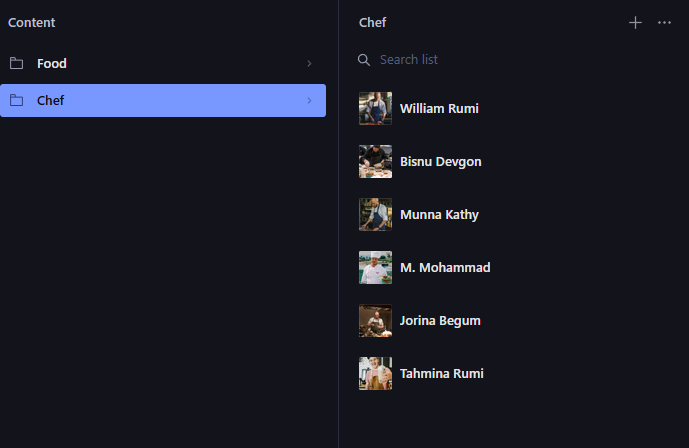
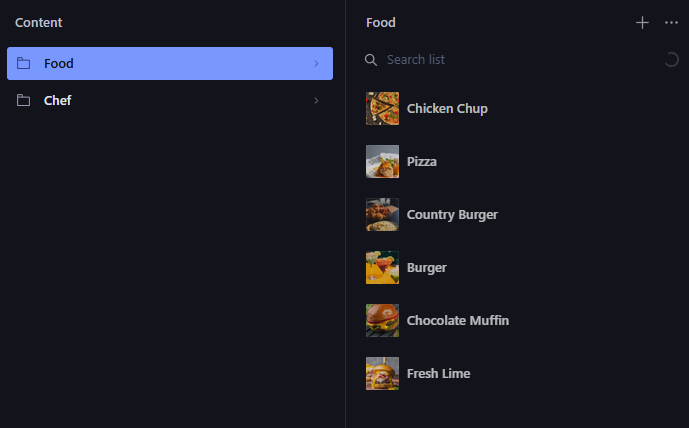
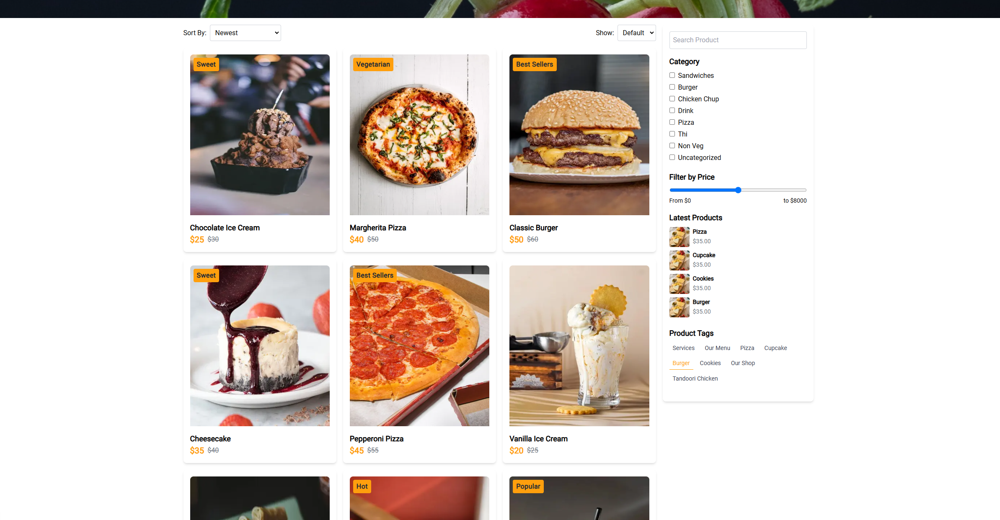
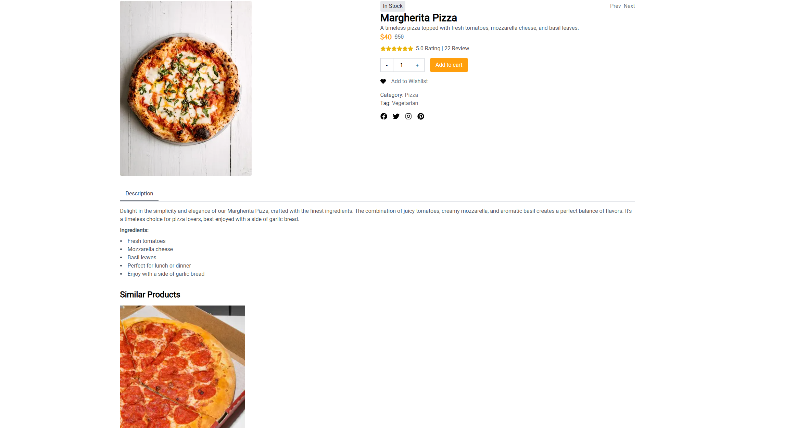
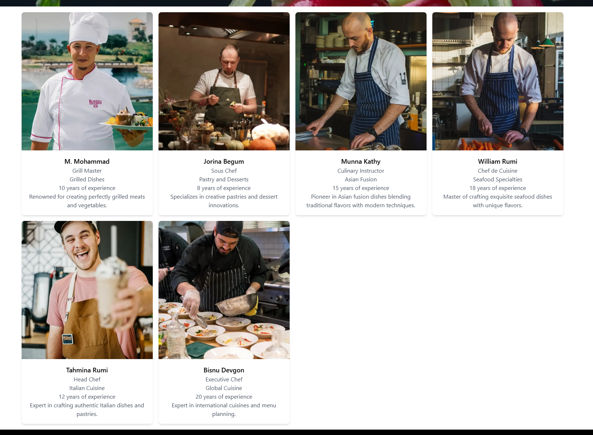

# Marketplace Builder Hackathon 2025 - [Food Tuck] - Day 3 Submission

## API Integration and Data Migration

This document outlines the tasks completed during Day 3 of the Marketplace Builder Hackathon 2025, focusing on API integration and data migration for the e-commerce platform.

### Features Implemented
1. **Sanity Client Initialization**:
   - Integrated Sanity CMS using environment variables for secure access.
2. **Product Upload Functionality**:
   - Developed an `uploadProduct` function to upload products to Sanity CMS.
   - Handles image uploads and creates product documents dynamically.
3. **Data Import from External API**:
   - Implemented `importProducts` to fetch product data from an external API and upload to Sanity CMS.
4. **Frontend Integration**:
   - Displayed product listings with details such as image, price, description, and tags.
5. **Product Details Page**:
   - Detailed product pages showcasing images, descriptions, and pricing.
6. **Changes Made in Schema**:
   - I Created longDescription Schema for the content of a product 
7. **Manual Data Import**:
   - At first i imported the given data through API and given script (SS Attached) But after realizing that the data is not realistic and looks ugly then i manually created data for the products(only).
8. **How to Check Implementation of Chefs?**:
   - On the homepage scroll down to see the most recent chefs coming from sanity, click see more to view all chefs.
9. **How to Check Implementation of Products?**:
   - Toggle Shop in the Navbar so see the Products
10. **How to Check Implementation of Product Details?**:
   - Click on any product to see the details of the product
11. **Is there anything additional in your Day 3 Implementation**:
   - Yes, if you take a look in product details it also show the similar product which uses category of the product to show.   
### Code Highlights
#### Chef Dynamic Data Fetching
```typescript
  <div>
      <Head>
        <title>Our Chef</title>
      </Head>
      <div className="relative">
        <Image
          src="/navbarbg.jpg"
          alt="Fresh vegetables with dark background"
          className="w-full  object-cover"
          width={1920}
          height={1080}
        />
        <div className="absolute inset-0 flex flex-col items-center justify-center text-white">
          <h1 className="text-3xl font-bold">Our Chef</h1>
          <p className="text-lg">
            <span>Home</span> <span className="text-yellow-500">› Menu</span>
          </p>
        </div>
      </div>
      <div className="container mx-auto p-4">
        <div className="grid grid-cols-1 sm:grid-cols-2 md:grid-cols-3 lg:grid-cols-4 gap-4">
          {chefs.map((chef) => (
            <div
              key={chef._id}
              className="bg-white shadow-md rounded-lg overflow-hidden"
            >
              <Image
                src={chef.imageUrl || "/placeholder.jpg"}
                alt={chef.name}
                className="w-full h-96 object-cover"
                width={640}
                height={480}
              />
              <div className="p-4 text-center">
                <h2 className="text-lg font-semibold">{chef.name}</h2>
                <p className="text-gray-600">{chef.position}</p>
                <p className="text-gray-600">{chef.specialty}</p>
                <p className="text-gray-600">
                  {chef.experience} years of experience
                </p>
                <p className="text-gray-600">{chef.description}</p>
              </div>
            </div>
          ))}
        </div>
      </div>
    </div>
```
#### Products Dynamic Data Fetching
```typescript
 <div className="grid grid-cols-1 md:grid-cols-2 lg:grid-cols-3 gap-4">
            {foodItems.map((product) => (
              <Link
                key={product._id}
                href={`/shopdetail/${product._id}`}
                passHref
              >
                <div className="bg-white p-4 rounded-lg shadow-md cursor-pointer">
                  <div className="relative">
                    {product.tags &&
                      product.tags.map((tag) => (
                        <span
                          key={tag}
                          className="absolute top-2 left-2 bg-[#FF9F0D] tracking-wide text-gray-800 font-bold text-md px-2 py-1  rounded"
                        >
                          {tag}
                        </span>
                      ))}
                    <Image
                      alt={product.name || "Product Image"}
                      className="w-full h-96 object-center rounded-t-lg"
                      src={product.imageUrl || "https://placehold.co/300x300"}
                      width={300}
                      height={300}
                    />
                  </div>
                  <div className="mt-4">
                    <h3 className="text-lg font-semibold">
                      {product.name || "Unnamed Product"}
                    </h3>
                    <div className="flex items-center">
                      <span className="text-[#FF9F0D] text-xl font-bold">
                        {product.price ? `$${product.price}` : "$0.00"}
                      </span>
                      {product.originalPrice && (
                        <span className="text-gray-500 line-through ml-2">
                          {`$${product.originalPrice}`}
                        </span>
                      )}
                    </div>
                  </div>
                </div>
              </Link>
            ))}
          </div>
```
#### Product Details Dynamic Data Fetching
```typescript
<div className="relative">
        <Image
          src="/navbarbg.jpg"
          alt="Fresh vegetables with dark background"
          className="w-full object-cover"
          width={1920}
          height={640}
        />
        <div className="absolute inset-0 flex flex-col items-center justify-center text-white">
          <h1 className="text-3xl font-bold">Product Detail</h1>
          <p className="text-lg">
            <span>Home</span> <span className="text-yellow-500">› Product</span>
          </p>
        </div>
      </div>
      <div className="container mx-auto p-4">
        <div className="grid grid-cols-1 md:grid-cols-2 gap-4">
          <div className="flex">
            <div className="flex  space-y-2 ">
              <Image
                src={product.imageUrl || "/placeholder.jpg"}
                alt={product.name}
                className="w-full object-cover rounded"
                width={300}
                height={300}
              />
            </div>
           
          </div>

          <div className="flex flex-col">
            <div className="flex justify-between items-center">
              <span className="bg-gray-200 text-gray-800 px-2 py-1 rounded">
                {product.available ? "In Stock" : "Out of Stock"}
              </span>
              <div className="flex space-x-2">
                <button className="text-gray-500 hover:text-gray-700">
                  Prev
                </button>
                <button className="text-gray-500 hover:text-gray-700">
                  Next
                </button>
              </div>
            </div>

            <h1 className="text-3xl font-bold">{product.name}</h1>
            <p className="text-gray-600">{product.description}</p>

            <div className="flex items-center">
              <span className="text-[#FF9F0D] text-xl font-bold">
                {product.price ? `$${product.price}` : "$0.00"}
              </span>
              {product.originalPrice && (
                <span className="text-gray-500 line-through ml-2">
                  {`$${product.originalPrice}`}
                </span>
              )}
            </div>
            <div className="flex items-center mt-2">
              <div className="flex items-center">
                <FaStar className="text-yellow-500" />
                <FaStar className="text-yellow-500" />
                <FaStar className="text-yellow-500" />
                <FaStar className="text-yellow-500" />
                <FaStar className="text-yellow-500" />
                <FaStar className="text-yellow-500" />
              </div>
              <span className="ml-2 text-gray-600">5.0 Rating | 22 Review</span>
            </div>

            <div className="flex items-center mt-4">
              <button className="px-4 py-2 border border-gray-300 h-10">
                -
              </button>
              <input
                type="text"
                className="w-12 text-center border-t border-b border-gray-300 h-10"
                value="1"
                readOnly
              />
              <button className="px-4 py-2 border border-gray-300 h-10">
                +
              </button>
              <a href="/cart">
                <button className="ml-4 px-4 py-2 bg-[#FF9F0D] text-white rounded h-10">
                  Add to cart
                </button>
              </a>
            </div>
            <div className="flex items-center mt-4 space-x-4">
              <FaHeart />
              <button className="text-gray-500 hover:text-gray-700">
                Add to Wishlist
              </button>
            </div>
            <div className="mt-4">
              <div className="text-gray-700">
                Category:{" "}
                <span className="text-gray-500">{product.category}</span>
              </div>
              <div className="text-gray-700">
                Tag:{" "}
                <span className="text-gray-500">
                  {product.tags?.join(", ")}
                </span>
              </div>
            </div>


            <div className="flex space-x-4 mt-4">
              <FaFacebook className="text-xl hover:text-[#FF9F0D]" />
              <FaTwitter className="text-xl hover:text-[#FF9F0D]" />
              <FaInstagram className="text-xl hover:text-[#FF9F0D]" />
              <FaPinterest className="text-xl hover:text-[#FF9F0D]" />
            </div>
          </div>
        </div>
        <div className='mt-8'>
          <div className='flex space-x-4 border-b border-gray-300'>
            <button className='px-4 py-2 text-gray-700 border-b-2 border-gray-800'>
              Description
            </button>
          </div>
          <div className='mt-4 text-gray-600'>
            <PortableText
              value={product.longDescription || []}
              components={{
                block: {
                  h1: ({ children }) => <h1 className="text-2xl font-bold">{children}</h1>,
                  h2: ({ children }) => <h2 className="text-xl font-bold">{children}</h2>,
                  h3: ({ children }) => <h3 className="text-lg font-bold">{children}</h3>,
                  normal: ({ children }) => <p className="mt-2">{children}</p>,
                },
                list: {
                  bullet: ({ children }) => <ul className="list-disc list-inside mt-2">{children}</ul>,
                  number: ({ children }) => <ol className="list-decimal list-inside mt-2">{children}</ol>,
                },
                marks: {
                  strong: ({ children }) => <strong>{children}</strong>,
                  em: ({ children }) => <em>{children}</em>,
                  link: ({ value, children }) => (
                    <a href={value.href} className="text-blue-500 hover:underline">
                      {children}
                    </a>
                  ),
                },
              }}
            />
          </div>
        </div>
```

### Screenshots
#### Code Implementation




#### Frontend Screenshots





